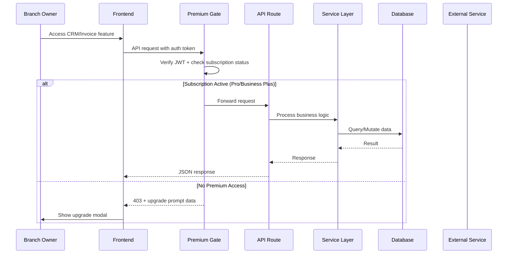

# Design Document: Business CRM & Invoicing Module

## Overview

The Business CRM & Invoicing Module extends the Parichay platform from a digital presence tool into a full-fledged business operations suite. It introduces customer relationship management, professional invoice generation with Indian GST compliance, payment collection via existing gateways, automated reminders, expense tracking, and revenue analytics — all gated behind premium subscription tiers.

### Design Decisions & Rationale

1. **Separate Customer model from Lead**: Customers represent ongoing relationships with richer data (invoices, interactions, segments), while Leads remain prospects in the sales pipeline. A Lead converts to a Customer via explicit action.
2. **Business Invoice vs Platform Invoice**: The existing `Invoice` model handles platform subscription billing. Business Invoices are a distinct concept — invoices the *business owner* sends to *their customers*. A new `BusinessInvoice` model avoids conflating these concerns.
3. **PDFKit for PDF generation**: The project already uses `pdfkit` for subscription invoices. We reuse this for business invoices with enhanced templates.
4. **Cron-based automation**: Recurring invoices, reminders, and greetings use Next.js API cron routes (already established pattern in `/api/cron/`).
5. **Branch-level data isolation**: All CRM data belongs to a Branch, consistent with the existing multi-tenant architecture. Premium access is checked at the Brand level.
6. **Soft delete pattern**: Customer deletion uses a `deletedAt` field with 30-day retention, consistent with the existing User soft-delete pattern.

## Architecture

### High-Level Architecture

```mermaid
graph TB
    subgraph "Frontend (Next.js App Router)"
        UI[Business Owner Dashboard]
        CRM_UI[CRM Module UI]
        INV_UI[Invoice Module UI]
        DASH_UI[Revenue Dashboard UI]
    end

    subgraph "API Layer (Next.js Route Handlers)"
        GATE[Premium Gate Middleware]
        CRM_API[/api/crm/*]
        INV_API[/api/business-invoices/*]
        EXP_API[/api/expenses/*]
        REV_API[/api/revenue/*]
        PAY_API[/api/payments/invoice/*]
    end

    subgraph "Service Layer"
        CRM_SVC[CRM Service]
        INV_SVC[Invoice Engine Service]
        PDF_SVC[PDF Generator Service]
        REM_SVC[Reminder Engine Service]
        SEG_SVC[Segmentation Service]
        REV_SVC[Revenue Analytics Service]
    end

    subgraph "Data Layer"
        PRISMA[Prisma ORM]
        MYSQL[(MySQL Database)]
        S3[AWS S3 / Cloud Storage]
        REDIS[(Redis Cache)]
    end

    subgraph "External Services"
        RAZORPAY[Razorpay]
        STRIPE[Stripe]
        SMTP[Email Service]
        WHATSAPP[WhatsApp API]
        SMS[SMS Service]
    end

    subgraph "Cron Jobs"
        CRON_REM[/api/cron/invoice-reminders]
        CRON_REC[/api/cron/recurring-invoices]
        CRON_GREET[/api/cron/customer-greetings]
        CRON_OVERDUE[/api/cron/overdue-invoices]
    end

    UI --> GATE
    CRM_UI --> GATE
    INV_UI --> GATE
    DASH_UI --> GATE

    GATE --> CRM_API
    GATE --> INV_API
    GATE --> EXP_API
    GATE --> REV_API

    CRM_API --> CRM_SVC
    INV_API --> INV_SVC
    INV_SVC --> PDF_SVC
    EXP_API --> REV_SVC
    REV_API --> REV_SVC
    PAY_API --> INV_SVC

    CRM_SVC --> PRISMA
    INV_SVC --> PRISMA
    REV_SVC --> PRISMA
    PDF_SVC --> S3
    REM_SVC --> SMTP
    REM_SVC --> SMS
    REM_SVC --> WHATSAPP
    SEG_SVC --> PRISMA

    PRISMA --> MYSQL
    INV_SVC --> RAZORPAY
    INV_SVC --> STRIPE

    CRON_REM --> REM_SVC
    CRON_REC --> INV_SVC
    CRON_GREET --> REM_SVC
    CRON_OVERDUE --> INV_SVC
```

### Request Flow



### Folder Structure

```
src/
├── app/
│   ├── api/
│   │   ├── crm/
│   │   │   ├── customers/
│   │   │   │   ├── route.ts              # GET (list), POST (create)
│   │   │   │   ├── [id]/
│   │   │   │   │   ├── route.ts          # GET, PUT, DELETE
│   │   │   │   │   └── interactions/
│   │   │   │   │       └── route.ts      # GET, POST
│   │   │   │   ├── import/
│   │   │   │   │   └── route.ts          # POST (CSV import)
│   │   │   │   ├── export/
│   │   │   │   │   └── route.ts          # GET (CSV export)
│   │   │   │   └── segments/
│   │   │   │       └── route.ts          # GET, POST
│   │   │   ├── expenses/
│   │   │   │   ├── route.ts              # GET, POST
│   │   │   │   └── [id]/
│   │   │   │       └── route.ts          # GET, PUT, DELETE
│   │   │   └── review-requests/
│   │   │       └── route.ts              # GET, POST
│   │   ├── business-invoices/
│   │   │   ├── route.ts                  # GET (list), POST (create)
│   │   │   ├── [id]/
│   │   │   │   ├── route.ts             # GET, PUT, DELETE
│   │   │   │   ├── pdf/
│   │   │   │   │   └── route.ts         # GET (generate/download PDF)
│   │   │   │   ├── send/
│   │   │   │   │   └── route.ts         # POST (send to customer)
│   │   │   │   ├── payments/
│   │   │   │   │   └── route.ts         # POST (record payment)
│   │   │   │   └── duplicate/
│   │   │   │       └── route.ts         # POST (duplicate invoice)
│   │   │   ├── recurring/
│   │   │   │   └── route.ts             # GET, POST, PUT
│   │   │   ├── settings/
│   │   │   │   └── route.ts             # GET, PUT (invoice config)
│   │   │   └── items/
│   │   │       └── route.ts             # GET, POST (reusable items)
│   │   ├── revenue/
│   │   │   ├── dashboard/
│   │   │   │   └── route.ts             # GET (metrics)
│   │   │   └── export/
│   │   │       └── route.ts             # GET (export report)
│   │   ├── cron/
│   │   │   ├── invoice-reminders/
│   │   │   │   └── route.ts
│   │   │   ├── recurring-invoices/
│   │   │   │   └── route.ts
│   │   │   ├── overdue-invoices/
│   │   │   │   └── route.ts
│   │   │   └── customer-greetings/
│   │   │       └── route.ts
│   │   └── public/
│   │       └── pay/
│   │           └── [linkId]/
│   │               └── route.ts          # GET (payment page data)
│   ├── business-owner/
│   │   ├── crm/
│   │   │   ├── page.tsx                  # Customer list
│   │   │   ├── [id]/
│   │   │   │   └── page.tsx             # Customer profile
│   │   │   ├── segments/
│   │   │   │   └── page.tsx
│   │   │   └── import/
│   │   │       └── page.tsx
│   │   ├── invoices/
│   │   │   ├── page.tsx                  # Invoice list
│   │   │   ├── new/
│   │   │   │   └── page.tsx             # Create invoice
│   │   │   ├── [id]/
│   │   │   │   └── page.tsx             # Invoice detail
│   │   │   ├── recurring/
│   │   │   │   └── page.tsx
│   │   │   └── settings/
│   │   │       └── page.tsx             # Invoice customization
│   │   ├── expenses/
│   │   │   └── page.tsx
│   │   └── revenue/
│   │       └── page.tsx                  # Revenue dashboard
│   └── pay/
│       └── [linkId]/
│           └── page.tsx                  # Public payment page
├── components/
│   ├── crm/
│   │   ├── CustomerList.tsx
│   │   ├── CustomerProfile.tsx
│   │   ├── CustomerForm.tsx
│   │   ├── InteractionLog.tsx
│   │   ├── InteractionForm.tsx
│   │   ├── SegmentBuilder.tsx
│   │   ├── CustomerImport.tsx
│   │   └── BulkActions.tsx
│   ├── invoices/
│   │   ├── InvoiceList.tsx
│   │   ├── InvoiceForm.tsx
│   │   ├── InvoicePreview.tsx
│   │   ├── LineItemEditor.tsx
│   │   ├── GSTFields.tsx
│   │   ├── InvoiceSettings.tsx
│   │   ├── RecurringInvoiceForm.tsx
│   │   └── PaymentRecorder.tsx
│   ├── expenses/
│   │   ├── ExpenseList.tsx
│   │   ├── ExpenseForm.tsx
│   │   └── ExpenseSummary.tsx
│   └── revenue/
│       ├── RevenueDashboard.tsx
│       ├── RevenueChart.tsx
│       ├── InvoiceStatusChart.tsx
│       └── TopCustomers.tsx
├── lib/
│   ├── crm/
│   │   ├── customer-service.ts
│   │   ├── interaction-service.ts
│   │   ├── segment-service.ts
│   │   └── review-request-service.ts
│   ├── invoices/
│   │   ├── invoice-service.ts
│   │   ├── business-pdf-generator.ts
│   │   ├── gst-calculator.ts
│   │   ├── invoice-number-generator.ts
│   │   ├── payment-link-service.ts
│   │   └── recurring-invoice-service.ts
│   ├── expenses/
│   │   └── expense-service.ts
│   ├── revenue/
│   │   └── analytics-service.ts
│   ├── reminders/
│   │   └── reminder-service.ts
│   └── premium-gate.ts
└── types/
    ├── crm.ts
    ├── invoice.ts
    └── revenue.ts
```

## Components and Interfaces

### Premium Gate Middleware

```typescript
// src/lib/premium-gate.ts
import { NextRequest, NextResponse } from 'next/server';
import { getAuthenticatedUser } from '@/lib/auth-utils';
import { prisma } from '@/lib/prisma';

export type PremiumFeature = 'CRM' | 'INVOICING' | 'EXPENSES' | 'REVENUE_DASHBOARD';

const PREMIUM_PLANS = ['PRO', 'BUSINESS_PLUS'];
const GRACE_PERIOD_DAYS = 7;

export interface PremiumGateResult {
  allowed: boolean;
  reason?: 'NO_AUTH' | 'NO_SUBSCRIPTION' | 'PLAN_INSUFFICIENT' | 'EXPIRED' | 'GRACE_PERIOD';
  readOnly?: boolean; // true during grace period or after expiry
  brandId?: string;
  branchIds?: string[];
}

export async function checkPremiumAccess(
  request: NextRequest,
  feature: PremiumFeature
): Promise<PremiumGateResult>;

export function withPremiumGate(
  feature: PremiumFeature,
  handler: (req: NextRequest, context: PremiumGateResult) => Promise<NextResponse>
): (req: NextRequest) => Promise<NextResponse>;
```

### CRM Service Interface

```typescript
// src/lib/crm/customer-service.ts
export interface CreateCustomerInput {
  name: string;
  phone?: string;
  email?: string;
  address?: string;
  companyName?: string;
  tags?: string[];
  customFields?: Record<string, string>;
  notes?: string;
  birthday?: Date;
  anniversary?: Date;
  branchId: string;
}

export interface CustomerFilters {
  search?: string;       // name, phone, email
  tags?: string[];
  createdAfter?: Date;
  createdBefore?: Date;
  lastInteractionAfter?: Date;
  lastInteractionBefore?: Date;
  page?: number;
  limit?: number;
  sortBy?: 'name' | 'createdAt' | 'lastInteractionAt' | 'totalInvoiceValue';
  sortOrder?: 'asc' | 'desc';
}

export interface CustomerService {
  create(input: CreateCustomerInput): Promise<Customer>;
  update(id: string, input: Partial<CreateCustomerInput>): Promise<Customer>;
  delete(id: string): Promise<void>; // soft delete
  getById(id: string, branchId: string): Promise<CustomerProfile>;
  list(branchId: string, filters: CustomerFilters): Promise<PaginatedResult<Customer>>;
  convertFromLead(leadId: string, branchId: string): Promise<Customer>;
  importFromCSV(file: Buffer, branchId: string): Promise<ImportResult>;
  exportToCSV(branchId: string, fields: string[]): Promise<Buffer>;
}
```

### Invoice Engine Interface

```typescript
// src/lib/invoices/invoice-service.ts
export interface CreateInvoiceInput {
  customerId: string;
  branchId: string;
  invoiceDate: Date;
  dueDate: Date;
  lineItems: LineItemInput[];
  discount?: { type: 'PERCENTAGE' | 'FLAT'; value: number };
  notes?: string;
  gstEnabled?: boolean;
  placeOfSupply?: string; // State code for GST
}

export interface LineItemInput {
  description: string;
  quantity: number;
  unitPrice: number;
  taxRate: number;      // 0, 5, 12, 18, or 28
  hsnSacCode?: string;  // Required if GST enabled
}

export interface InvoiceService {
  create(input: CreateInvoiceInput): Promise<BusinessInvoice>;
  update(id: string, input: Partial<CreateInvoiceInput>): Promise<BusinessInvoice>;
  cancel(id: string): Promise<BusinessInvoice>;
  duplicate(id: string): Promise<BusinessInvoice>;
  recordPayment(id: string, amount: number, method: string, reference?: string): Promise<BusinessInvoice>;
  generatePDF(id: string): Promise<{ url: string; buffer: Buffer }>;
  send(id: string, channels: ('email' | 'whatsapp')[]): Promise<void>;
  generatePaymentLink(id: string): Promise<string>;
  markOverdue(): Promise<number>; // batch operation for cron
  getById(id: string, branchId: string): Promise<BusinessInvoice>;
  list(branchId: string, filters: InvoiceFilters): Promise<PaginatedResult<BusinessInvoice>>;
}
```

### GST Calculator

```typescript
// src/lib/invoices/gst-calculator.ts
export interface GSTBreakdown {
  subtotal: number;
  cgst: number;
  sgst: number;
  igst: number;
  totalTax: number;
  grandTotal: number;
  isInterState: boolean;
}

export interface GSTLineItem {
  amount: number;        // quantity * unitPrice
  taxRate: number;       // 0, 5, 12, 18, 28
  hsnSacCode: string;
}

export function calculateGST(
  lineItems: GSTLineItem[],
  sellerStateCode: string,
  buyerStateCode: string,
  discount?: { type: 'PERCENTAGE' | 'FLAT'; value: number }
): GSTBreakdown;

export function validateGSTIN(gstin: string): boolean;

export function getStateFromGSTIN(gstin: string): string;
```

### Payment Link Service

```typescript
// src/lib/invoices/payment-link-service.ts
export interface PaymentLinkData {
  id: string;
  invoiceId: string;
  url: string;
  amount: number;
  currency: string;
  status: 'ACTIVE' | 'PAID' | 'EXPIRED';
  expiresAt: Date;
  gateway: 'RAZORPAY' | 'STRIPE';
  externalOrderId?: string;
}

export interface PaymentLinkService {
  generate(invoiceId: string): Promise<PaymentLinkData>;
  getByLinkId(linkId: string): Promise<PaymentLinkData & { invoice: BusinessInvoice }>;
  processPayment(linkId: string, paymentData: PaymentWebhookData): Promise<void>;
  expire(linkId: string): Promise<void>;
}
```

### Reminder Engine

```typescript
// src/lib/reminders/reminder-service.ts
export interface ReminderConfig {
  branchId: string;
  autoRemindersEnabled: boolean;
  reminderSchedule: {
    beforeDueDays: number;   // default: 3
    onDueDate: boolean;      // default: true
    afterDueDays: number;    // default: 7
    maxReminders: number;    // default: 4
    intervalDays: number;    // default: 7
  };
  channels: ('in_app' | 'email' | 'sms')[];
}

export interface ReminderService {
  processOverdueReminders(): Promise<number>;
  processCustomReminders(): Promise<number>;
  processCustomerGreetings(): Promise<number>;
  setCustomReminder(customerId: string, reminder: CustomReminderInput): Promise<Reminder>;
  getReminderConfig(branchId: string): Promise<ReminderConfig>;
  updateReminderConfig(branchId: string, config: Partial<ReminderConfig>): Promise<ReminderConfig>;
}
```

### Revenue Analytics Service

```typescript
// src/lib/revenue/analytics-service.ts
export interface RevenueDashboardData {
  totalRevenue: number;
  totalOutstanding: number;
  totalOverdue: number;
  invoicesByStatus: Record<BusinessInvoiceStatus, number>;
  monthlyRevenueTrend: { month: string; revenue: number }[];
  topCustomers: { customerId: string; name: string; revenue: number }[];
  avgCollectionDays: number;
  totalExpenses: number;
  netProfit: number;
  expensesByCategory: Record<string, number>;
}

export interface RevenueService {
  getDashboard(branchId: string, dateRange: DateRange): Promise<RevenueDashboardData>;
  getMonthlyTrend(branchId: string, months: number): Promise<MonthlyTrend[]>;
  getTopCustomers(branchId: string, dateRange: DateRange, limit: number): Promise<TopCustomer[]>;
}
```

### Segment Service

```typescript
// src/lib/crm/segment-service.ts
export interface SegmentCriteria {
  tags?: string[];
  lastInteractionBefore?: Date;
  lastInteractionAfter?: Date;
  minInvoiceValue?: number;
  maxInvoiceValue?: number;
  createdBefore?: Date;
  createdAfter?: Date;
}

export interface SegmentService {
  create(branchId: string, name: string, criteria: SegmentCriteria): Promise<CustomerSegment>;
  computeCount(criteria: SegmentCriteria, branchId: string): Promise<number>;
  getCustomers(segmentId: string): Promise<Customer[]>;
  sendBulkMessage(segmentId: string, channel: 'email' | 'whatsapp', template: string): Promise<BulkSendResult>;
  exportSegment(segmentId: string): Promise<Buffer>;
}
```

## Data Models

### Prisma Schema Extensions

```prisma
// === CRM Models ===

model Customer {
  id            String    @id @default(cuid())
  name          String
  phone         String?
  email         String?
  address       String?   @db.Text
  companyName   String?
  tags          Json?     // string[] - max 20 tags
  customFields  Json?     // Record<string, string>
  notes         String?   @db.Text
  birthday      DateTime?
  anniversary   DateTime?

  // Soft delete
  deletedAt     DateTime?

  // Metrics (denormalized for performance)
  totalInvoiceValue  Float   @default(0)
  lastInteractionAt  DateTime?

  // Relationships
  branchId      String
  branch        Branch    @relation(fields: [branchId], references: [id], onDelete: Cascade)
  leadId        String?   @unique  // Link to originating lead
  lead          Lead?     @relation(fields: [leadId], references: [id], onDelete: SetNull)

  interactions  CustomerInteraction[]
  invoices      BusinessInvoice[]
  reminders     CustomerReminder[]
  greetingLogs  GreetingLog[]
  reviewRequests ReviewRequest[]

  createdAt     DateTime  @default(now())
  updatedAt     DateTime  @updatedAt

  @@index([branchId, deletedAt])
  @@index([name])
  @@index([phone])
  @@index([email])
  @@index([lastInteractionAt])
  @@map("customers")
}

model CustomerInteraction {
  id          String   @id @default(cuid())
  type        InteractionType
  summary     String?  @db.Text
  duration    Int?     // seconds, for calls
  attachments Json?    // [{name, url, size}] - max 3
  metadata    Json?    // Additional data (e.g., appointment ID, invoice ID)

  loggedById  String?
  loggedByName String?

  customerId  String
  customer    Customer @relation(fields: [customerId], references: [id], onDelete: Cascade)

  createdAt   DateTime @default(now())

  @@index([customerId, createdAt])
  @@map("customer_interactions")
}

enum InteractionType {
  PHONE_CALL
  WHATSAPP
  EMAIL
  IN_PERSON
  SMS
  CUSTOM
  APPOINTMENT_BOOKED
  INVOICE_SENT
  PAYMENT_RECEIVED
}

// === Invoice Models ===

model BusinessInvoice {
  id              String    @id @default(cuid())
  invoiceNumber   String    @unique @db.VarChar(50)
  status          BusinessInvoiceStatus @default(DRAFT)

  invoiceDate     DateTime
  dueDate         DateTime

  // Line items stored as JSON for flexibility
  lineItems       Json      // LineItem[]

  // Amounts
  subtotal        Float
  discountType    String?   // 'PERCENTAGE' | 'FLAT'
  discountValue   Float?
  discountAmount  Float     @default(0)
  taxAmount       Float     @default(0)
  grandTotal      Float
  amountPaid      Float     @default(0)
  balanceDue      Float

  // GST fields (nullable - only when GST enabled)
  gstEnabled      Boolean   @default(false)
  sellerGstin     String?
  buyerGstin      String?
  placeOfSupply   String?   // State code
  cgstTotal       Float?
  sgstTotal       Float?
  igstTotal       Float?

  // Document
  notes           String?   @db.Text
  pdfUrl          String?
  pdfGeneratedAt  DateTime?

  // Currency
  currency        String    @default("INR")

  // Relationships
  customerId      String
  customer        Customer  @relation(fields: [customerId], references: [id])
  branchId        String
  branch          Branch    @relation(fields: [branchId], references: [id], onDelete: Cascade)

  payments        InvoicePayment[]
  paymentLinks    InvoicePaymentLink[]
  recurringConfig RecurringInvoice?

  createdAt       DateTime  @default(now())
  updatedAt       DateTime  @updatedAt

  @@index([branchId, status])
  @@index([customerId])
  @@index([dueDate, status])
  @@index([invoiceNumber])
  @@map("business_invoices")
}

enum BusinessInvoiceStatus {
  DRAFT
  SENT
  VIEWED
  PARTIALLY_PAID
  PAID
  OVERDUE
  CANCELLED
}

model InvoicePayment {
  id              String   @id @default(cuid())
  amount          Float
  method          String   // 'CASH', 'BANK_TRANSFER', 'UPI', 'RAZORPAY', 'STRIPE', 'OTHER'
  reference       String?  // Transaction ID or reference
  notes           String?

  invoiceId       String
  invoice         BusinessInvoice @relation(fields: [invoiceId], references: [id], onDelete: Cascade)

  createdAt       DateTime @default(now())

  @@index([invoiceId])
  @@map("invoice_payments")
}

model InvoicePaymentLink {
  id              String   @id @default(cuid())
  linkCode        String   @unique @db.VarChar(36) // Short unique code for URL
  amount          Float
  currency        String   @default("INR")
  status          PaymentLinkStatus @default(ACTIVE)
  gateway         PaymentGateway
  externalOrderId String?

  expiresAt       DateTime
  paidAt          DateTime?

  invoiceId       String
  invoice         BusinessInvoice @relation(fields: [invoiceId], references: [id], onDelete: Cascade)

  createdAt       DateTime @default(now())
  updatedAt       DateTime @updatedAt

  @@index([linkCode])
  @@index([invoiceId])
  @@map("invoice_payment_links")
}

enum PaymentLinkStatus {
  ACTIVE
  PAID
  EXPIRED
  FAILED
}

model RecurringInvoice {
  id              String   @id @default(cuid())
  frequency       RecurringFrequency
  nextGenerateAt  DateTime
  endDate         DateTime?
  maxOccurrences  Int?
  occurrenceCount Int      @default(0)
  isPaused        Boolean  @default(false)
  autoSend        Boolean  @default(false) // Auto-send or require approval

  invoiceId       String   @unique  // Template invoice
  invoice         BusinessInvoice @relation(fields: [invoiceId], references: [id], onDelete: Cascade)
  branchId        String

  createdAt       DateTime @default(now())
  updatedAt       DateTime @updatedAt

  @@index([nextGenerateAt, isPaused])
  @@index([branchId])
  @@map("recurring_invoices")
}

enum RecurringFrequency {
  WEEKLY
  BI_WEEKLY
  MONTHLY
  QUARTERLY
  YEARLY
}

// === Invoice Settings ===

model InvoiceSettings {
  id              String   @id @default(cuid())

  // Business details for invoice header
  businessName    String
  businessAddress String?  @db.Text
  phone           String?
  email           String?
  logoUrl         String?
  signatureUrl    String?
  gstin           String?

  // Bank details
  bankName        String?
  accountNumber   String?
  ifscCode        String?
  upiId           String?

  // Defaults
  defaultPaymentTerms String? @db.Text
  footerNote      String?  @db.Text
  colorAccent     String?  @default("#3B82F6")
  templateStyle   String   @default("MODERN") // MODERN, CLASSIC, MINIMAL
  invoicePrefix   String   @default("INV")

  // Branch relation
  branchId        String   @unique
  branch          Branch   @relation(fields: [branchId], references: [id], onDelete: Cascade)

  createdAt       DateTime @default(now())
  updatedAt       DateTime @updatedAt

  @@map("invoice_settings")
}

model ReusableLineItem {
  id          String   @id @default(cuid())
  description String
  unitPrice   Float
  taxRate     Float    @default(18)
  hsnSacCode  String?
  unit        String?  // 'hrs', 'nos', 'kg', etc.

  branchId    String
  branch      Branch   @relation(fields: [branchId], references: [id], onDelete: Cascade)

  createdAt   DateTime @default(now())
  updatedAt   DateTime @updatedAt

  @@index([branchId])
  @@map("reusable_line_items")
}

// === Expense Tracking ===

model Expense {
  id          String   @id @default(cuid())
  amount      Float
  date        DateTime
  category    String
  description String?  @db.Text
  vendorName  String?
  receiptUrl  String?  // S3 URL

  branchId    String
  branch      Branch   @relation(fields: [branchId], references: [id], onDelete: Cascade)

  createdAt   DateTime @default(now())
  updatedAt   DateTime @updatedAt

  @@index([branchId, date])
  @@index([category])
  @@map("expenses")
}

model ExpenseCategory {
  id          String   @id @default(cuid())
  name        String
  isDefault   Boolean  @default(false) // Pre-defined categories

  branchId    String?  // null = system default
  branch      Branch?  @relation(fields: [branchId], references: [id], onDelete: Cascade)

  createdAt   DateTime @default(now())

  @@unique([branchId, name])
  @@map("expense_categories")
}

// === Reminders & Greetings ===

model CustomerReminder {
  id          String   @id @default(cuid())
  reminderDate DateTime
  message     String   @db.Text
  channel     String   // 'in_app', 'email', 'sms'
  status      String   @default("PENDING") // PENDING, SENT, CANCELLED

  customerId  String
  customer    Customer @relation(fields: [customerId], references: [id], onDelete: Cascade)
  branchId    String

  createdAt   DateTime @default(now())

  @@index([reminderDate, status])
  @@index([customerId])
  @@map("customer_reminders")
}

model ReminderConfig {
  id                    String  @id @default(cuid())
  autoRemindersEnabled  Boolean @default(true)
  beforeDueDays         Int     @default(3)
  onDueDateEnabled      Boolean @default(true)
  afterDueDays          Int     @default(7)
  maxReminders          Int     @default(4)
  intervalDays          Int     @default(7)
  channels              Json    // string[]

  branchId              String  @unique
  branch                Branch  @relation(fields: [branchId], references: [id], onDelete: Cascade)

  updatedAt             DateTime @updatedAt

  @@map("reminder_configs")
}

model GreetingTemplate {
  id          String   @id @default(cuid())
  type        String   // 'birthday', 'anniversary'
  channel     String   // 'email', 'whatsapp', 'sms'
  subject     String?
  body        String   @db.Text // Supports {{customer_name}}, {{business_name}}, etc.
  includeDiscount Boolean @default(false)
  discountDays    Int?   // Validity period for auto-generated discount
  sendTime    String   @default("09:00") // HH:mm in branch timezone
  isActive    Boolean  @default(true)

  branchId    String
  branch      Branch   @relation(fields: [branchId], references: [id], onDelete: Cascade)

  createdAt   DateTime @default(now())
  updatedAt   DateTime @updatedAt

  @@index([branchId, type])
  @@map("greeting_templates")
}

model GreetingLog {
  id          String   @id @default(cuid())
  type        String   // 'birthday', 'anniversary'
  year        Int      // To prevent duplicate sends in same year
  channel     String
  status      String   @default("SENT") // SENT, FAILED
  discountCode String?

  customerId  String
  customer    Customer @relation(fields: [customerId], references: [id], onDelete: Cascade)

  sentAt      DateTime @default(now())

  @@unique([customerId, type, year])
  @@map("greeting_logs")
}

// === Customer Segments ===

model CustomerSegment {
  id          String   @id @default(cuid())
  name        String
  criteria    Json     // SegmentCriteria

  branchId    String
  branch      Branch   @relation(fields: [branchId], references: [id], onDelete: Cascade)

  createdAt   DateTime @default(now())
  updatedAt   DateTime @updatedAt

  @@index([branchId])
  @@map("customer_segments")
}

// === Review Requests ===

model ReviewRequest {
  id              String   @id @default(cuid())
  status          String   @default("PENDING") // PENDING, SENT, CLICKED, REVIEWED
  scheduledFor    DateTime
  sentAt          DateTime?
  clickedAt       DateTime?
  channel         String   // 'email', 'whatsapp'

  customerId      String
  customer        Customer @relation(fields: [customerId], references: [id], onDelete: Cascade)
  invoiceId       String?
  branchId        String

  createdAt       DateTime @default(now())

  @@index([scheduledFor, status])
  @@index([customerId])
  @@map("review_requests")
}

model ReviewRequestConfig {
  id                String  @id @default(cuid())
  isEnabled         Boolean @default(true)
  delayDays         Int     @default(2) // Days after invoice paid
  googleReviewLink  String?
  messageTemplate   String? @db.Text
  channel           String  @default("email") // 'email', 'whatsapp'
  cooldownDays      Int     @default(90) // Min days between requests per customer

  branchId          String  @unique
  branch            Branch  @relation(fields: [branchId], references: [id], onDelete: Cascade)

  updatedAt         DateTime @updatedAt

  @@map("review_request_configs")
}

// === Invoice Number Sequence ===

model InvoiceSequence {
  id          String   @id @default(cuid())
  prefix      String
  financialYear String  // "2425" for 2024-2025
  lastNumber  Int      @default(0)

  branchId    String
  branch      Branch   @relation(fields: [branchId], references: [id], onDelete: Cascade)

  @@unique([branchId, financialYear])
  @@map("invoice_sequences")
}
```

### Branch Model Extensions

The existing `Branch` model needs additional relations:

```prisma
// Add to existing Branch model
model Branch {
  // ... existing fields ...

  // CRM relations
  customers         Customer[]
  businessInvoices  BusinessInvoice[]
  expenses          Expense[]
  expenseCategories ExpenseCategory[]
  invoiceSettings   InvoiceSettings?
  reusableLineItems ReusableLineItem[]
  reminderConfig    ReminderConfig?
  greetingTemplates GreetingTemplate[]
  customerSegments  CustomerSegment[]
  reviewRequestConfig ReviewRequestConfig?
  invoiceSequences  InvoiceSequence[]
}
```

### Lead Model Extension

```prisma
// Add to existing Lead model
model Lead {
  // ... existing fields ...
  customer  Customer?  // Reverse relation for converted leads
}
```

## Correctness Properties

*A property is a characteristic or behavior that should hold true across all valid executions of a system — essentially, a formal statement about what the system should do. Properties serve as the bridge between human-readable specifications and machine-verifiable correctness guarantees.*

### Property 1: Premium Gate Access Control

*For any* user with a given subscription state (plan type, status, payment failure date), the Premium Gate SHALL correctly grant access only when the plan is Pro or Business Plus AND status is ACTIVE or within the 7-day grace period, and SHALL deny access otherwise — granting read-only mode for expired subscriptions with existing data.

**Validates: Requirements 1.1, 1.2, 1.3, 1.4, 1.6**

### Property 2: Lead-to-Customer Data Preservation

*For any* Lead that transitions to CONVERTED status, the resulting Customer record SHALL contain all data fields from the originating Lead (name, phone, email) and SHALL maintain a link back to the originating Lead.

**Validates: Requirements 2.2**

### Property 3: Customer Search Filter Correctness

*For any* set of customers in a branch and any valid filter criteria (name substring, phone, email, tags, date ranges), the returned results SHALL contain only customers matching ALL specified filter criteria, and SHALL contain every customer that matches.

**Validates: Requirements 2.4**

### Property 4: CSV Import Valid/Invalid Split

*For any* CSV file containing a mix of valid and invalid rows, the import operation SHALL import all valid rows and SHALL report errors for all invalid rows, such that (imported count + error count) equals the total row count.

**Validates: Requirements 2.7**

### Property 5: CSV Export Field Selection

*For any* set of customers and any subset of selectable fields, the exported CSV SHALL contain exactly one row per customer and exactly the selected columns, with cell values matching the stored customer data.

**Validates: Requirements 2.8**

### Property 6: Branch Data Isolation

*For any* two distinct branches within the same or different brands, querying customers for one branch SHALL never return customers belonging to the other branch.

**Validates: Requirements 2.9**

### Property 7: Invoice Total Arithmetic

*For any* set of line items with quantities and unit prices, and an optional discount, the invoice engine SHALL calculate: subtotal = Σ(quantity × unitPrice), discountAmount based on type/value, and grandTotal = subtotal - discountAmount + taxAmount.

**Validates: Requirements 4.3**

### Property 8: Sequential Invoice Numbering

*For any* sequence of invoices created for a branch within the same financial year, the generated invoice numbers SHALL follow the pattern {prefix}-{financialYear}-{sequence} where sequence is strictly incrementing with no gaps, and no two invoices SHALL share the same number.

**Validates: Requirements 4.2, 4.8**

### Property 9: Invoice Partial Payment Balance Tracking

*For any* invoice and any sequence of partial payments recorded against it, the balanceDue SHALL always equal grandTotal minus the sum of all payment amounts, and the status SHALL transition to PARTIALLY_PAID when 0 < amountPaid < grandTotal, and to PAID when amountPaid >= grandTotal.

**Validates: Requirements 4.7**

### Property 10: GST Intra-State vs Inter-State Calculation

*For any* GST-enabled invoice with line items, if the seller and buyer are in the same state then CGST = SGST = (taxRate/2) × taxableAmount and IGST = 0; if they are in different states then IGST = taxRate × taxableAmount and CGST = SGST = 0. The total tax summary SHALL equal the sum of per-line-item taxes.

**Validates: Requirements 5.2, 5.3, 5.6**

### Property 11: GSTIN Format Validation

*For any* string input, the GSTIN validator SHALL accept it if and only if it matches the 15-character alphanumeric pattern: 2-digit state code + 10-character PAN + 1-digit entity number + 1 check character + 'Z' (or valid character at position 14).

**Validates: Requirements 5.5**

### Property 12: INR Indian Number Formatting

*For any* non-negative number, formatting as INR SHALL produce the Indian grouping pattern where the last three digits are grouped, then every two digits thereafter (e.g., 1,23,45,678.00), prefixed with ₹.

**Validates: Requirements 6.5**

### Property 13: Payment Link Expiry Logic

*For any* invoice payment link, it SHALL be active if and only if: (a) the creation date is less than 90 days ago AND (b) the associated invoice is not fully paid. The link SHALL transition to EXPIRED after 90 days or to PAID upon full payment.

**Validates: Requirements 7.2, 7.8**

### Property 14: Failed Payment Status Preservation

*For any* invoice in any status and a payment attempt that fails, the invoice status SHALL remain unchanged after the failure event.

**Validates: Requirements 7.7**

### Property 15: Revenue Dashboard Aggregation

*For any* set of invoices within a date range, the revenue dashboard SHALL report: total revenue = sum of amountPaid for PAID/PARTIALLY_PAID invoices, total outstanding = sum of balanceDue for non-cancelled invoices, invoice counts by status matching the actual count of invoices in each status, and top customers sorted descending by their total paid amount.

**Validates: Requirements 9.1, 9.3, 9.4, 9.5**

### Property 16: Expense Filtering and Aggregation

*For any* set of expenses and any combination of filters (category, date range, vendor), the returned expenses SHALL match all filter criteria, and monthly totals SHALL equal the sum of expenses within each calendar month.

**Validates: Requirements 10.4, 10.5**

### Property 17: Profit Calculation

*For any* branch over any date range, net profit SHALL equal the total revenue collected (sum of payments received) minus the total expenses recorded within that date range.

**Validates: Requirements 10.3**

### Property 18: Customer Segment Criteria Matching

*For any* segment definition with criteria (tags, date ranges, invoice value thresholds), the computed customer count SHALL equal the number of customers in the branch that satisfy ALL specified criteria simultaneously.

**Validates: Requirements 11.1, 11.2**

### Property 19: Greeting Template Placeholder Substitution

*For any* greeting template containing placeholders ({{customer_name}}, {{business_name}}, {{discount_code}}, {{date}}) and any customer data, rendering the template SHALL replace every placeholder with its corresponding value, leaving no unsubstituted placeholder tokens in the output.

**Validates: Requirements 12.3**

### Property 20: Duplicate Greeting Prevention

*For any* customer with a birthday or anniversary, the system SHALL send at most one greeting of each type per calendar year. Attempting to send a second greeting of the same type in the same year SHALL be blocked.

**Validates: Requirements 12.6**

### Property 21: Recurring Invoice Generation with Limits

*For any* recurring invoice configuration with a maximum occurrence count or end date, the system SHALL generate new invoices only while occurrenceCount < maxOccurrences AND currentDate < endDate, and SHALL stop generating once either limit is reached.

**Validates: Requirements 14.2, 14.3**

### Property 22: Review Request Cooldown

*For any* customer, the system SHALL not send a review request if a previous request was sent within the configured cooldown period (default 90 days). Only after the cooldown period has elapsed SHALL a new request be allowed.

**Validates: Requirements 15.6**

### Property 23: Overdue Invoice Detection

*For any* invoice with status SENT or VIEWED whose due date has passed and whose balanceDue > 0, the overdue detection process SHALL transition the status to OVERDUE.

**Validates: Requirements 4.5**

### Property 24: Invoice Duplication

*For any* existing invoice, duplicating it SHALL produce a new invoice in DRAFT status with a new sequential invoice number, the same customer, and identical line items (description, quantity, unitPrice, taxRate), but with new invoice date and due date.

**Validates: Requirements 4.6**

## Error Handling

### API Error Response Format

All API routes follow a consistent error response structure:

```typescript
interface ErrorResponse {
  success: false;
  error: string;          // Human-readable message
  code?: string;          // Machine-readable error code
  details?: unknown;      // Validation errors or additional context
}
```

### Error Categories

| Category | HTTP Status | Handling |
|----------|-------------|----------|
| Authentication failure | 401 | Redirect to login |
| Premium feature access denied | 403 | Show upgrade prompt with plan comparison |
| Resource not found | 404 | Show "not found" with navigation back |
| Validation error | 400 | Show field-level errors inline |
| Branch access violation | 403 | Log audit event, show generic error |
| Rate limit exceeded (bulk messaging) | 429 | Show retry-after timer |
| Payment gateway error | 502 | Show retry option, notify owner |
| PDF generation failure | 500 | Queue for retry, show "generating..." |
| CSV import partial failure | 207 | Show success/error split with downloadable error report |
| File upload size exceeded | 413 | Show max file size message |

### Specific Error Scenarios

1. **Invoice Number Collision**: Use database unique constraint + retry with next sequence number (max 3 retries)
2. **Payment Link Generation Failure**: Return invoice without payment link, allow manual retry
3. **Concurrent Partial Payments**: Use optimistic locking on `amountPaid` field with version check
4. **Recurring Invoice Generation Failure**: Log error, skip to next occurrence, notify owner
5. **Email/SMS Delivery Failure**: Queue for retry (max 3 attempts with exponential backoff), mark as FAILED after exhaustion
6. **GSTIN Validation API Unavailable**: Accept format-valid GSTINs without online verification, flag for later validation
7. **CSV Import Memory**: Stream large files row-by-row using Papa Parse's streaming mode (already in dependencies)
8. **S3 Upload Failure**: Retry with exponential backoff (3 attempts), fall back to local generation if all fail

### Graceful Degradation

- If Redis is unavailable: Skip caching, serve directly from database
- If email service is down: Queue reminders in database, process on next cron run
- If payment gateway is unreachable: Allow manual payment recording, disable payment links temporarily
- If S3 is unreachable: Generate PDF in-memory and serve directly (don't persist)

## Testing Strategy

### Dual Testing Approach

This module uses both property-based tests and example-based unit tests for comprehensive coverage.

**Property-Based Testing Library**: `fast-check` (already in devDependencies)

**Test Runner**: `vitest` (already configured)

### Property-Based Tests

Each correctness property (Properties 1–24) maps to a property-based test with:
- Minimum **100 iterations** per property test
- Tag format: `Feature: business-crm-invoicing, Property {N}: {title}`
- Generators for: Customer records, LineItem arrays, GSTINs, dates, subscription states, CSV data

**Key generators needed:**
- `arbitraryCustomer()` — valid customer with random fields
- `arbitraryLineItems(min, max)` — array of invoice line items with valid quantities/prices
- `arbitraryGSTIN()` — valid 15-character GSTIN strings
- `arbitraryInvoice()` — complete invoice with line items and optional GST
- `arbitrarySubscriptionState()` — combination of plan, status, dates
- `arbitraryCSVRow()` — valid/invalid customer CSV rows
- `arbitraryDateRange()` — start/end date pairs
- `arbitrarySegmentCriteria()` — random segment filter criteria

### Unit Tests (Example-Based)

Focus on:
- API route handlers: auth checks, input validation, response shapes
- Service layer: specific edge cases not covered by property tests
- Integration points: email template rendering, payment webhook processing
- UI components: rendering with various props

### Integration Tests

- Payment gateway webhook handling (Razorpay/Stripe)
- PDF generation pipeline (PDFKit → S3 upload → URL return)
- Cron job execution (overdue detection, recurring generation, reminders)
- CSV import/export pipeline with real file I/O

### Test Organization

```
src/__tests__/
├── crm/
│   ├── customer-service.property.test.ts
│   ├── customer-service.test.ts
│   ├── segment-service.property.test.ts
│   └── interaction-service.test.ts
├── invoices/
│   ├── invoice-service.property.test.ts
│   ├── gst-calculator.property.test.ts
│   ├── invoice-number.property.test.ts
│   ├── payment-link.property.test.ts
│   ├── recurring-invoice.property.test.ts
│   └── pdf-generator.test.ts
├── revenue/
│   ├── analytics-service.property.test.ts
│   └── expense-service.property.test.ts
├── premium-gate.property.test.ts
├── reminders/
│   ├── reminder-service.test.ts
│   └── greeting-service.property.test.ts
└── utils/
    ├── inr-formatter.property.test.ts
    └── gstin-validator.property.test.ts
```

### E2E Tests

Extend existing Playwright tests for:
- Premium gate upgrade flow
- Full invoice creation → PDF → send → payment flow
- Customer CRM lifecycle (create → interact → segment → bulk message)
- Revenue dashboard data accuracy

