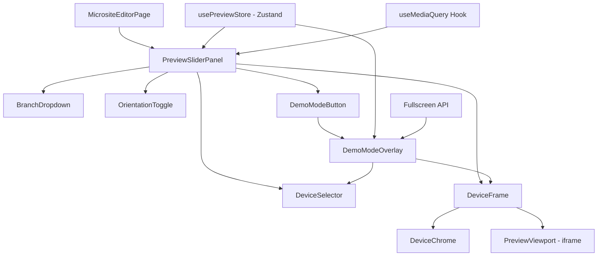
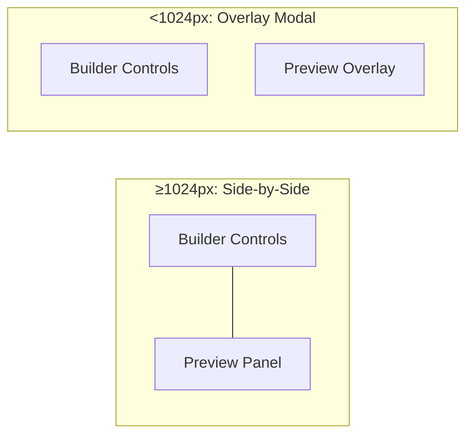
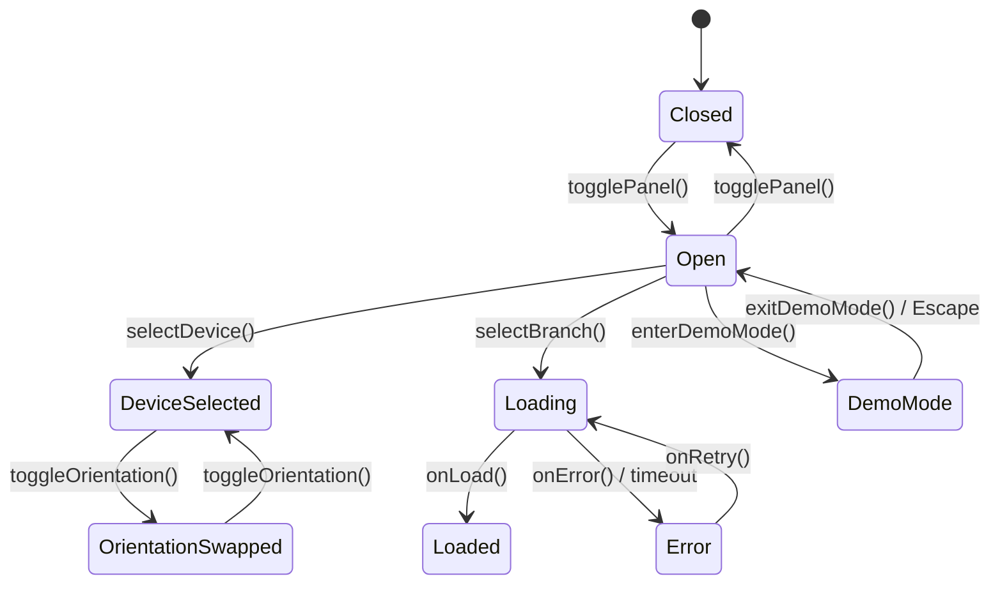

# Design Document: Device Preview Slider

## Overview

The Device Preview Slider is a client-side UI feature integrated into the Parichay admin panel's microsite builder. It provides shop owners and marketing personnel with an in-browser device simulation tool that renders microsites within realistic device frames (mobile, tablet, desktop) without leaving the admin interface.

The feature builds upon the existing `MicrositePreviewModal` component pattern but introduces persistent inline preview, device chrome rendering, orientation toggling, and a fullscreen Demo Mode for client presentations. It operates entirely on the client side using React state management and CSS transformations, with the only server interaction being the existing microsite/branch API endpoints.

### Key Design Decisions

1. **Iframe-based rendering** — Microsites are rendered in a sandboxed iframe to provide true viewport isolation and avoid CSS conflicts with the admin panel.
2. **Client-side state only** — No new database models or API endpoints are required. Device frame preferences are ephemeral per session.
3. **Progressive enhancement** — The split-panel layout degrades to an overlay/modal on narrow viewports (<1024px).
4. **Framer Motion for transitions** — Leveraging the existing `framer-motion` dependency for smooth 300ms viewport transitions.
5. **Zustand for preview state** — Using the existing `zustand` store pattern (see `admin-store.ts`) to manage preview panel state.

## Architecture



### Layout Modes



## Components and Interfaces

### Component Tree

| Component | Responsibility | Location |
|-----------|---------------|----------|
| `PreviewSliderPanel` | Container for all preview controls and frame; manages layout mode | `src/components/preview/PreviewSliderPanel.tsx` |
| `DeviceSelector` | Radio group for device frame selection (mobile/tablet/desktop) | `src/components/preview/DeviceSelector.tsx` |
| `DeviceFrame` | Renders device chrome (bezel, status bar, notch) around viewport | `src/components/preview/DeviceFrame.tsx` |
| `PreviewViewport` | Iframe container that loads and displays the microsite | `src/components/preview/PreviewViewport.tsx` |
| `OrientationToggle` | Button to swap width/height for mobile/tablet frames | `src/components/preview/OrientationToggle.tsx` |
| `BranchDropdown` | Dropdown to select which branch microsite to preview | `src/components/preview/BranchDropdown.tsx` |
| `DemoModeOverlay` | Fullscreen overlay that hides admin chrome for presentations | `src/components/preview/DemoModeOverlay.tsx` |

### State Management — `usePreviewStore`

```typescript
// src/lib/preview-store.ts
import { create } from 'zustand';

type DeviceType = 'mobile' | 'tablet' | 'desktop';
type Orientation = 'portrait' | 'landscape';
type PreviewStatus = 'idle' | 'loading' | 'loaded' | 'error';

interface DevicePreset {
  type: DeviceType;
  label: string;
  width: number;
  height: number;
  defaultOrientation: Orientation;
  hasOrientationToggle: boolean;
}

interface PreviewState {
  // Panel visibility
  isOpen: boolean;

  // Device selection
  activeDevice: DeviceType;
  orientation: Orientation;

  // Branch selection
  selectedBranchId: string | null;
  selectedBranchStatus: 'published' | 'draft' | 'none';

  // Loading state
  status: PreviewStatus;
  errorMessage: string | null;

  // Demo mode
  isDemoMode: boolean;

  // Computed viewport dimensions
  viewportWidth: number;
  viewportHeight: number;

  // Actions
  togglePanel: () => void;
  selectDevice: (device: DeviceType) => void;
  toggleOrientation: () => void;
  selectBranch: (branchId: string, status: 'published' | 'draft' | 'none') => void;
  setStatus: (status: PreviewStatus, error?: string) => void;
  enterDemoMode: () => boolean; // returns false if no microsite loaded
  exitDemoMode: () => void;
  refresh: () => void;
}
```

### Device Presets Configuration

```typescript
// src/config/device-presets.ts
export const DEVICE_PRESETS: DevicePreset[] = [
  {
    type: 'mobile',
    label: 'Mobile',
    width: 375,
    height: 667,
    defaultOrientation: 'portrait',
    hasOrientationToggle: true,
  },
  {
    type: 'tablet',
    label: 'Tablet',
    width: 768,
    height: 1024,
    defaultOrientation: 'landscape',
    hasOrientationToggle: true,
  },
  {
    type: 'desktop',
    label: 'Desktop',
    width: 1280,
    height: 800,
    defaultOrientation: 'landscape',
    hasOrientationToggle: false,
  },
];
```

### Key Interfaces

```typescript
// Props for DeviceFrame component
interface DeviceFrameProps {
  device: DeviceType;
  orientation: Orientation;
  width: number;
  height: number;
  children: React.ReactNode;
  isDemoMode?: boolean;
}

// Props for PreviewViewport component
interface PreviewViewportProps {
  branchId: string;
  brandSlug: string;
  width: number;
  height: number;
  status: PreviewStatus;
  errorMessage: string | null;
  onRetry: () => void;
  onLoad: () => void;
  onError: (message: string) => void;
  refreshKey: number; // increment to force iframe reload
}

// Props for DeviceSelector component
interface DeviceSelectorProps {
  activeDevice: DeviceType;
  onSelect: (device: DeviceType) => void;
  presets: DevicePreset[];
}

// Props for BranchDropdown
interface BranchDropdownProps {
  branches: BranchOption[];
  selectedBranchId: string | null;
  onSelect: (branchId: string, status: 'published' | 'draft' | 'none') => void;
}

interface BranchOption {
  id: string;
  name: string;
  status: 'published' | 'draft' | 'none';
}
```

## Data Models

No new database models are required. The feature uses existing data:

- **Branch** — Fetched via existing `/api/brands/[id]` endpoint to populate the branch dropdown. Fields used: `id`, `name`, `micrositeConfig` (to determine published/draft/none status).
- **Brand** — The current user's brand context determines which branches appear in the dropdown.

### State Flow



### Viewport Dimension Calculation

```typescript
function computeViewportDimensions(
  preset: DevicePreset,
  orientation: Orientation
): { width: number; height: number } {
  const isSwapped = orientation !== preset.defaultOrientation;
  if (isSwapped && preset.hasOrientationToggle) {
    return { width: preset.height, height: preset.width };
  }
  return { width: preset.width, height: preset.height };
}
```

### Demo Mode Scaling

```typescript
function computeDemoScale(
  deviceWidth: number,
  deviceHeight: number,
  viewportWidth: number,
  viewportHeight: number,
  minFillRatio: number = 0.8
): number {
  const scaleX = (viewportWidth * minFillRatio) / deviceWidth;
  const scaleY = (viewportHeight * minFillRatio) / deviceHeight;
  return Math.min(scaleX, scaleY);
}
```

### Responsive Layout Mode

```typescript
function getLayoutMode(windowWidth: number): 'side-by-side' | 'overlay' {
  return windowWidth >= 1024 ? 'side-by-side' : 'overlay';
}
```

## Correctness Properties

*A property is a characteristic or behavior that should hold true across all valid executions of a system — essentially, a formal statement about what the system should do. Properties serve as the bridge between human-readable specifications and machine-verifiable correctness guarantees.*

### Property 1: Device selection idempotence

*For any* device frame option that is already the active selection, re-selecting it should produce no state change — the viewport dimensions, orientation, and content state must remain identical before and after the action.

**Validates: Requirements 1.5**

### Property 2: Orientation toggle is a self-inverse (round-trip)

*For any* device frame with dimensions (width, height) that supports orientation toggling, applying the orientation toggle twice should restore the original dimensions exactly: `toggle(toggle(w, h)) === (w, h)`.

**Validates: Requirements 4.5**

### Property 3: Content update triggers preview refresh

*For any* content modification event emitted by the microsite builder, the preview refresh mechanism should be triggered exactly once, updating the iframe without a full page navigation.

**Validates: Requirements 2.3, 3.5**

### Property 4: Responsive layout mode threshold

*For any* browser window width value, the preview panel layout mode should be `'overlay'` when width < 1024 and `'side-by-side'` when width ≥ 1024. This boundary condition must hold for all integer values of width.

**Validates: Requirements 3.4**

### Property 5: Demo mode scaling preserves aspect ratio and fills viewport

*For any* device frame dimensions (dw, dh) and any browser viewport dimensions (vw, vh), the computed scale factor must satisfy: (a) the scaled device width equals `dw * scale` and scaled height equals `dh * scale` (aspect ratio preserved), and (b) `max(dw * scale / vw, dh * scale / vh) >= 0.8` (at least 80% fill on the constraining axis), and (c) the scaled dimensions do not exceed the viewport (`dw * scale <= vw` and `dh * scale <= vh`).

**Validates: Requirements 5.5**

### Property 6: Keyboard navigation correctness

*For any* sequence of Arrow key presses within the device selector group, focus should move to the adjacent option in the direction pressed, wrapping or clamping at boundaries. Pressing Enter or Space on a focused option should activate it (equivalent to clicking).

**Validates: Requirements 7.1**

### Property 7: ARIA labels contain device name and dimensions

*For any* device preset in the configuration, the rendered ARIA label for that option must contain the device type name and both the width and height dimension values as text.

**Validates: Requirements 7.2**

### Property 8: Live region announces device changes

*For any* device frame transition from device A to device B (where A ≠ B), the live region element's text content should be updated to include the new device name and its viewport dimensions.

**Validates: Requirements 7.4**

### Property 9: Viewport dimension computation correctness

*For any* device preset and orientation value, `computeViewportDimensions(preset, orientation)` should return `(preset.height, preset.width)` when orientation differs from the default and the device supports orientation toggle, and `(preset.width, preset.height)` otherwise.

**Validates: Requirements 1.2, 4.3, 4.4, 4.5**

## Error Handling

| Scenario | Behavior | Recovery |
|----------|----------|----------|
| Microsite fails to load (timeout > 10s) | Display error message with failure reason in PreviewViewport | Retry button re-attempts load |
| Network error during microsite fetch | Display "Network error" message | Retry button; check connectivity |
| Repeated retry failures | Error message persists; retry button remains available | User can keep retrying |
| Branch has no microsite content | Display empty-state message in viewport | User selects different branch |
| Fullscreen API not supported | Demo Mode button triggers manual CSS fullscreen fallback | Graceful degradation |
| Demo Mode activated with no microsite loaded | Show informational toast; block Demo Mode entry | User must select a branch first |
| Branch API fetch fails | Dropdown shows error state | Retry fetching branches |
| iframe sandbox violation | Content won't render; show permission error | Suggest opening in new tab |

### Error State Component

```typescript
interface PreviewErrorProps {
  message: string;
  onRetry: () => void;
}
```

The error state renders within the DeviceFrame chrome, maintaining the device visual context while clearly communicating the failure.

## Testing Strategy

### Property-Based Tests (fast-check)

The project already includes `fast-check` as a dev dependency. Property-based tests will be written using `vitest` + `fast-check` with a minimum of 100 iterations per property.

**Target pure functions for PBT:**
- `computeViewportDimensions` — Properties 2, 9
- `computeDemoScale` — Property 5
- `getLayoutMode` — Property 4
- `formatAriaLabel` — Property 7
- Device selection reducer logic — Properties 1, 3

**Property test tag format:**
```typescript
// Feature: device-preview-slider, Property 1: Device selection idempotence
```

### Unit Tests (vitest)

- Device preset configuration validation (correct dimensions for each type)
- Default device selection on mount (mobile)
- Active device visual indicator state
- Status bar rendering for mobile/tablet only
- Default orientations (mobile=portrait, tablet=landscape)
- Demo Mode button presence and guard condition
- Branch dropdown default selection from route params
- Draft badge rendering for unpublished microsites
- Empty state for branches with no content
- Focus management on Demo Mode enter/exit
- Focus indicator CSS class application

### Integration Tests

- Branch list API fetch and dropdown population
- Iframe loads correct microsite URL for selected branch
- Content update in builder triggers iframe refresh
- Fullscreen API integration for Demo Mode
- Keyboard navigation through device options end-to-end

### Accessibility Testing

- ARIA role="radiogroup" on device selector
- ARIA role="radio" on each device option
- aria-checked state synchronization
- Live region (aria-live="polite") announcements
- Focus trap within Demo Mode overlay
- Escape key exits Demo Mode
- Tab order correctness
- Minimum 3:1 contrast ratio on focus indicators (manual verification with assistive tools)

> **Note:** Full WCAG compliance validation requires manual testing with assistive technologies and expert accessibility review.
