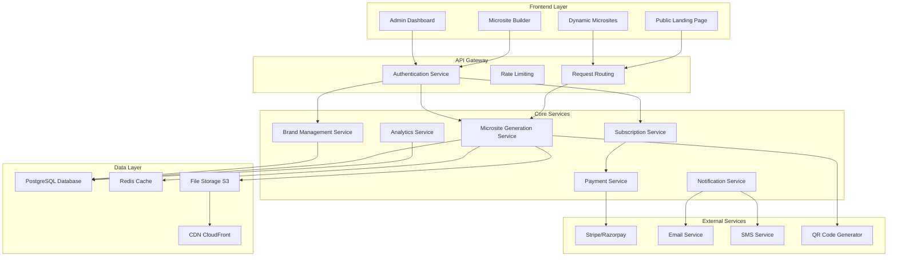
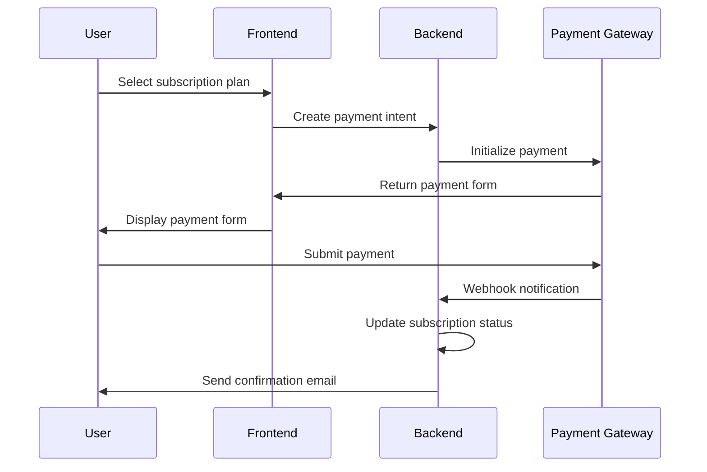
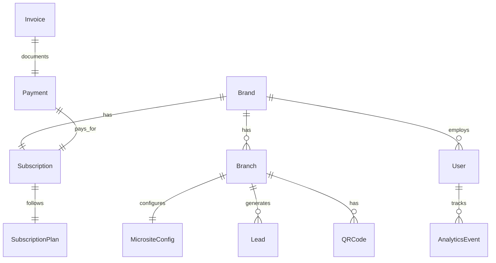
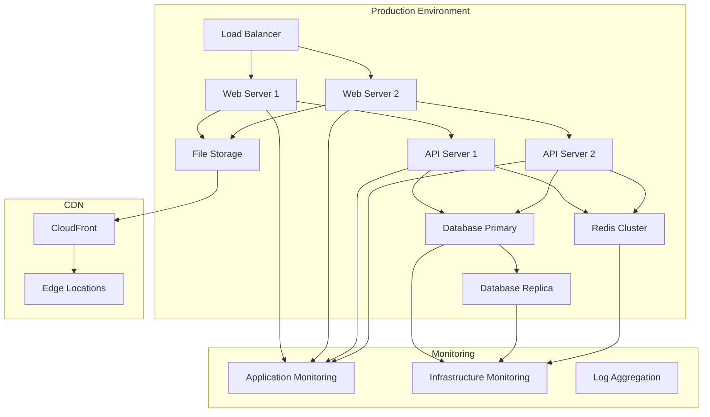

# Zintro Production Design Document

**Tagline**: Your smart digital introduction

## Overview

Zintro is a comprehensive multi-tenant SaaS platform that enables businesses to create dynamic, SEO-optimized microsites with the URL structure `zintro.com/{brand}/{branch}`. The platform combines a no-code website builder with subscription management, payment processing, analytics, and lead generation capabilities.

### Key Design Principles

- **Multi-tenancy**: Support for multiple brands with isolated data and customization
- **Scalability**: Horizontal scaling to handle thousands of microsites
- **SEO Optimization**: Dynamic URL generation and metadata management
- **Security**: Role-based access control and secure payment processing
- **Performance**: Fast loading microsites with CDN integration
- **Extensibility**: Modular architecture for future feature additions

## Architecture

### System Architecture Overview



### Technology Stack

**Frontend:**
- Next.js 14 with App Router for SSR and dynamic routing
- TypeScript for type safety
- Tailwind CSS for styling
- React Hook Form for form management
- Zustand for state management

**Backend:**
- Node.js with Express.js framework
- TypeScript for backend development
- Prisma ORM for database operations
- JWT for authentication
- Zod for validation

**Database:**
- PostgreSQL for primary data storage
- Redis for caching and session management

**Infrastructure:**
- AWS/Vercel for hosting
- CloudFront CDN for static assets
- S3 for file storage
- Docker for containerization

## Components and Interfaces

### Core Components

#### 1. Brand Management Component

**Purpose**: Manages brand creation, configuration, and theming

**Key Features:**
- Brand registration and profile management
- Logo upload and color theme configuration
- Custom domain setup and SSL management
- Brand-level settings and permissions

**API Endpoints:**
```typescript
POST /api/brands - Create new brand
GET /api/brands/:id - Get brand details
PUT /api/brands/:id - Update brand information
DELETE /api/brands/:id - Delete brand
POST /api/brands/:id/domains - Add custom domain
```

#### 2. Microsite Generation Component

**Purpose**: Handles dynamic microsite creation and rendering

**Key Features:**
- Dynamic URL routing (`/{brand}/{branch}`)
- Template-based page generation
- SEO metadata injection
- Real-time preview functionality

**URL Structure:**
```
zintro.com/{brand-slug}/{branch-slug}
custom-domain.com/{branch-slug} (for custom domains)
```

**API Endpoints:**
```typescript
GET /api/microsites/:brand/:branch - Render microsite
POST /api/microsites - Create microsite
PUT /api/microsites/:id - Update microsite
GET /api/microsites/:id/preview - Preview microsite
```

#### 3. Subscription Management Component

**Purpose**: Handles subscription plans, billing, and license management

**Key Features:**
- Tiered subscription plans
- Usage tracking and enforcement
- Automated billing cycles
- License key generation and validation

**Subscription Tiers:**
```typescript
interface SubscriptionPlan {
  id: string;
  name: string;
  price: number;
  duration: 'monthly' | 'yearly';
  features: {
    maxBranches: number;
    customDomain: boolean;
    analytics: boolean;
    qrCodes: boolean;
    leadCapture: boolean;
  };
}
```

#### 4. Payment Processing Component

**Purpose**: Manages payment gateway integration and transaction processing

**Key Features:**
- Multi-gateway support (Stripe, Razorpay)
- Webhook handling for payment events
- Automated invoice generation
- Refund and chargeback management

**Payment Flow:**


#### 5. Analytics and Reporting Component

**Purpose**: Tracks user interactions and generates insights

**Key Features:**
- Page view tracking
- Click analytics for contact actions
- QR code scan tracking
- Lead conversion metrics
- Export functionality (CSV, PDF)

**Analytics Data Model:**
```typescript
interface AnalyticsEvent {
  id: string;
  micrositeId: string;
  eventType: 'page_view' | 'click' | 'qr_scan' | 'lead_submit';
  metadata: Record<string, any>;
  timestamp: Date;
  userAgent: string;
  ipAddress: string;
  location?: {
    country: string;
    city: string;
  };
}
```

### User Interface Components

#### 1. Admin Dashboard

**Purpose**: Central management interface for super admins

**Key Sections:**
- Platform overview and metrics
- Brand and user management
- Subscription and billing overview
- System health monitoring

#### 2. Brand Dashboard

**Purpose**: Brand-specific management interface

**Key Sections:**
- Brand profile and settings
- Branch management
- Analytics and reporting
- Subscription management

#### 3. Microsite Builder

**Purpose**: Drag-and-drop interface for microsite creation

**Key Features:**
- Component-based page builder
- Real-time preview
- Brand theme application
- Mobile responsiveness preview

#### 4. Dynamic Microsite Renderer

**Purpose**: Public-facing microsite display

**Key Features:**
- Server-side rendering for SEO
- Mobile-responsive design
- Fast loading with CDN
- Contact action tracking

## Data Models

### Core Entities

#### Brand Entity
```typescript
interface Brand {
  id: string;
  name: string;
  slug: string;
  logo?: string;
  tagline?: string;
  colorTheme: {
    primary: string;
    secondary: string;
    accent: string;
  };
  customDomain?: string;
  sslEnabled: boolean;
  createdAt: Date;
  updatedAt: Date;
  ownerId: string;
  subscriptionId?: string;
}
```

#### Branch Entity
```typescript
interface Branch {
  id: string;
  name: string;
  slug: string;
  brandId: string;
  address: {
    street: string;
    city: string;
    state: string;
    zipCode: string;
    country: string;
  };
  contact: {
    phone: string;
    whatsapp?: string;
    email: string;
  };
  socialMedia: {
    facebook?: string;
    instagram?: string;
    linkedin?: string;
    twitter?: string;
  };
  businessHours: {
    [key: string]: {
      open: string;
      close: string;
      closed: boolean;
    };
  };
  micrositeConfig: MicrositeConfig;
  isActive: boolean;
  createdAt: Date;
  updatedAt: Date;
}
```

#### Microsite Configuration
```typescript
interface MicrositeConfig {
  templateId: string;
  sections: {
    hero: {
      enabled: boolean;
      title: string;
      subtitle: string;
      backgroundImage?: string;
    };
    about: {
      enabled: boolean;
      content: string;
    };
    services: {
      enabled: boolean;
      items: Array<{
        name: string;
        description: string;
        image?: string;
        price?: number;
      }>;
    };
    gallery: {
      enabled: boolean;
      images: string[];
    };
    contact: {
      enabled: boolean;
      showMap: boolean;
      leadForm: {
        enabled: boolean;
        fields: string[];
      };
    };
  };
  seoSettings: {
    title: string;
    description: string;
    keywords: string[];
    ogImage?: string;
  };
}
```

#### User Entity
```typescript
interface User {
  id: string;
  email: string;
  passwordHash: string;
  firstName: string;
  lastName: string;
  role: 'super_admin' | 'brand_manager' | 'branch_admin';
  brandId?: string;
  branchIds: string[];
  isActive: boolean;
  lastLoginAt?: Date;
  createdAt: Date;
  updatedAt: Date;
}
```

#### Subscription Entity
```typescript
interface Subscription {
  id: string;
  brandId: string;
  planId: string;
  status: 'active' | 'expired' | 'suspended' | 'cancelled';
  startDate: Date;
  endDate: Date;
  autoRenew: boolean;
  licenseKey: string;
  paymentGateway: 'stripe' | 'razorpay';
  externalSubscriptionId: string;
  createdAt: Date;
  updatedAt: Date;
}
```

### Database Schema Relationships



## Error Handling

### Error Classification

#### 1. Client Errors (4xx)
- **400 Bad Request**: Invalid input data or malformed requests
- **401 Unauthorized**: Authentication required or invalid credentials
- **403 Forbidden**: Insufficient permissions for requested action
- **404 Not Found**: Requested resource doesn't exist
- **409 Conflict**: Resource conflict (e.g., duplicate slug)
- **429 Too Many Requests**: Rate limit exceeded

#### 2. Server Errors (5xx)
- **500 Internal Server Error**: Unexpected server-side errors
- **502 Bad Gateway**: External service unavailable
- **503 Service Unavailable**: Temporary service disruption

### Error Response Format

```typescript
interface ErrorResponse {
  error: {
    code: string;
    message: string;
    details?: Record<string, any>;
    timestamp: string;
    requestId: string;
  };
}
```

### Error Handling Strategy

#### Frontend Error Handling
- Global error boundary for React components
- Toast notifications for user-facing errors
- Retry mechanisms for transient failures
- Graceful degradation for non-critical features

#### Backend Error Handling
- Centralized error middleware
- Structured logging with correlation IDs
- Circuit breaker pattern for external services
- Automatic retry with exponential backoff

#### Payment Error Handling
- Webhook retry mechanism with exponential backoff
- Payment failure notifications to users
- Automatic subscription suspension for failed payments
- Manual intervention alerts for critical payment issues

## Testing Strategy

### Testing Pyramid

#### 1. Unit Tests (70%)
**Scope**: Individual functions and components
**Tools**: Jest, React Testing Library
**Coverage**: Business logic, utility functions, component behavior

**Key Areas:**
- URL slug generation and validation
- Payment processing logic
- Subscription management functions
- Analytics data processing
- Template rendering logic

#### 2. Integration Tests (20%)
**Scope**: API endpoints and service interactions
**Tools**: Supertest, Test Containers
**Coverage**: Database operations, external service integrations

**Key Areas:**
- Authentication and authorization flows
- Payment gateway webhook processing
- Email and SMS notification delivery
- Microsite generation and rendering
- Analytics data collection

#### 3. End-to-End Tests (10%)
**Scope**: Complete user workflows
**Tools**: Playwright, Cypress
**Coverage**: Critical user journeys

**Key Scenarios:**
- Brand registration and onboarding
- Microsite creation and publishing
- Subscription purchase and management
- Lead generation and routing
- QR code generation and scanning

### Testing Environments

#### Development Environment
- Local database with test data
- Mock external services
- Hot reloading for rapid development

#### Staging Environment
- Production-like infrastructure
- Real external service integrations
- Automated deployment from main branch

#### Production Environment
- Live system with real users
- Monitoring and alerting
- Blue-green deployment strategy

### Performance Testing

#### Load Testing
- Simulate concurrent microsite visits
- Test payment processing under load
- Validate database performance with large datasets

#### Stress Testing
- Identify system breaking points
- Test recovery mechanisms
- Validate auto-scaling capabilities

### Security Testing

#### Authentication Testing
- JWT token validation
- Password security requirements
- Session management

#### Authorization Testing
- Role-based access control
- Multi-tenant data isolation
- API endpoint security

#### Payment Security Testing
- PCI DSS compliance validation
- Webhook signature verification
- Sensitive data encryption

## Deployment and Infrastructure

### Deployment Architecture



### CI/CD Pipeline

#### Development Workflow
1. Feature branch creation
2. Local development and testing
3. Pull request creation
4. Automated testing and code review
5. Merge to main branch
6. Automated deployment to staging
7. Manual approval for production deployment

#### Deployment Strategy
- **Blue-Green Deployment**: Zero-downtime deployments
- **Database Migrations**: Automated with rollback capability
- **Feature Flags**: Gradual feature rollout
- **Health Checks**: Automated deployment validation

### Monitoring and Observability

#### Application Monitoring
- **Metrics**: Response times, error rates, throughput
- **Logging**: Structured logs with correlation IDs
- **Tracing**: Distributed tracing for request flows
- **Alerting**: Real-time notifications for critical issues

#### Business Metrics
- **User Engagement**: Microsite visits, interaction rates
- **Revenue Metrics**: Subscription conversions, churn rates
- **System Health**: Uptime, performance benchmarks
- **Security Events**: Failed login attempts, suspicious activities

### Scalability Considerations

#### Horizontal Scaling
- **Stateless Services**: Enable easy horizontal scaling
- **Load Balancing**: Distribute traffic across multiple instances
- **Database Sharding**: Partition data for improved performance
- **Caching Strategy**: Multi-layer caching for optimal performance

#### Performance Optimization
- **CDN Integration**: Global content delivery
- **Image Optimization**: Automatic compression and format conversion
- **Database Indexing**: Optimized queries for fast data retrieval
- **Connection Pooling**: Efficient database connection management

