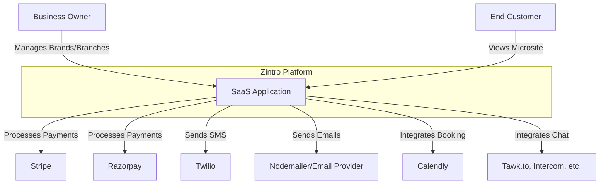

# 🎨 Zintro Product Diagrams

**Zintro** - Your smart digital introduction

This document contains high-level architecture and data flow diagrams for the Zintro platform.

---

## 1. System Context Diagram (C1)

This diagram shows Zintro as a whole and its interactions with users and external systems.



---

## 2. Container Diagram (C2)

This diagram breaks down the Zintro platform into its deployable containers.

```mermaid
graph TD
    U1[User Browser] -->|HTTPS| W[Next.js Web App on Vercel/Docker]

    W -->|API Calls (Prisma)| DB[(PostgreSQL Database)]
    W -->|Cache Lookups/Storage| R[(Redis Cache)]
    W -->|Stores/Retrieves Assets| S3[(AWS S3 Bucket)]
    U1 -->|Loads Static Assets| CDN[CloudFront CDN]
    S3 -->|Serves content via| CDN
```